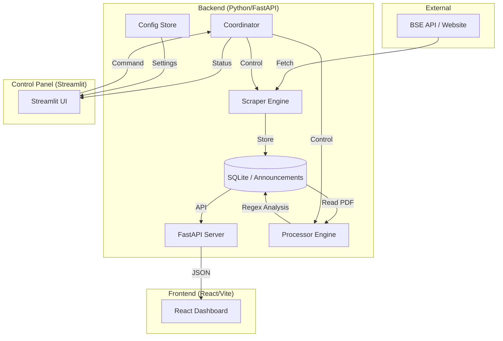

# BSE Data Project: Real-time Announcement Pipeline

A high-performance pipeline for fetching, filtering, and analyzing corporate announcements from the Bombay Stock Exchange (BSE). This project features a dual-interface architecture: a premium **React/Vite** dashboard for data consumption and a **Streamlit** control panel for administrative automation.

---

## 🏗️ Technical Architecture



---

## 🚀 Key Components

### 1. **Scraper Engine** (`backend/server/scraper_engine.py`)
- Fetches real-time JSON feeds from the BSE corporate announcements API.
- Implements **Scrip Filtering** (Watchlist) and **Tag Filtering** (Regex) at the edge before persistence.
- Handles rate-limiting and session management to ensure reliable data acquisition.

### 2. **Processor Engine** (`backend/server/processor_engine.py`)
- Performs deep-content analysis on downloaded PDF attachments.
- Uses `pdfplumber` for high-fidelity text extraction.
- Runs a multi-stage **Regex Flag System** to identify specific corporate events (e.g., Investor Meet dates, Revenue Guidance).

### 3. **FastAPI Backend** (`backend/server/main.py`)
- Provides a RESTful API for the React dashboard.
- Serves the production build of the React frontend.

### 4. **Streamlit Control Panel** (`app.py`)
- The "mission control" for the pipeline.
- Allows administrators to trigger manual runs, monitor engine logs in real-time, and configure global filtering rules.
- Includes a **System Reset** utility for database and log maintenance.

---

## 🛠️ Technology Stack

| Layer | Technology |
| :--- | :--- |
| **Frontend** | React 18, Vite, TypeScript, Vanilla CSS (Premium Aesthetics) |
| **Admin UI** | Streamlit |
| **API / Backend** | FastAPI, Uvicorn, Python 3.11+ |
| **PDF Processing** | pdfplumber, httpx (Async) |
| **Database** | SQLite3 |
| **Deployment** | Local development / custom hosting |

---

## 📦 Project Structure

```text
.
├── backend/
│   └── server/             # Core logic
│       ├── coordinator.py  # Task orchestration
│       ├── scraper_engine.py
│       ├── processor_engine.py
│       ├── store.py        # Database wrapper
│       └── main.py         # FastAPI Entry point
├── frontend/
│   └── src/                # React components & API client
├── data/                   # SQLite DB & PDF storage
├── logs/                   # System-wide logs (Backend, UI, Frontend)
├── app.py                  # Streamlit App
├── start-dev.ps1           # Local development launcher
└── README.md               # Project documentation
```

---

## 🛠️ Installation & Setup

### Prerequisites
- Python 3.11+
- Node.js 18+ (for frontend)

### Local Development
The project includes a unified launcher for Windows:
```powershell
./start-dev.ps1
```
This script will:
1. Initialize the Python virtual environment.
2. Install all dependencies (Python & NPM).
3. Concurrently launch **FastAPI** (8000), **Vite** (5173), and **Streamlit** (8501).

---

## Deployment
This project no longer includes Railway-specific deployment configuration. Use local startup scripts or your preferred deployment platform instead.
